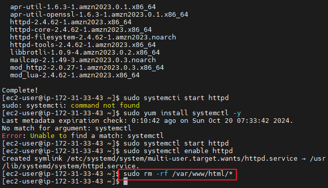

# Capstone Project - Introduction To Cloud Computing

## Task 1 - Implement Version Control With Git

### 1.1. - Initialiaze Git Repository

- I made a directory and named it `MarketPeak_Ecommerce`

- I navigated into the `MarketPeak` directory with the `cd` command

- I initialized `Git`

### 1.2. - Obtain and Prepare the E-Commerce Website Template

- I download the website template and extracted it to the `MarketPeak` directory

### 1.3. Stage and Commit the Template to Git

- Add Website Files to Git Repository

- Set Git Global Configuration With Username

- Set Git Global Configuration With Email

- Commit Change with the message `Initial commit with basic e-commerce site structure`

### 1.4. Pushing the Code to Github Repository

- Creating a Remote Github Repository with the name `MarketPeak_Ecommerce`

- Linking Local Repository to Github

- Push Repository

## Task 2 - AWS Deployment

### 2.1. Set Up an AWS EC2 Instance

- Launching an EC2 Instance

- Connect Using SSH

### 2.2. Clone the Repository on the Linux Server

- Authenticating with Github via SSH (i.e. adding SSH key to Github)

- Clone to gitub using the `git clone` command 

### 2.3. Install a Webserver on EC2

 - I ran the `sudo yum update` command

 

 - I ran the `sudo yum install httpd` command

 

 - I ran the `sudo systemctl start httpd` command

 

 - I ran the `sudo systemctl enable httpd` command 

 

 ### 2.4. - Configure httpd for Website

 - I cleared the default web directory using the `sudo rm -rf` command

 

 - I copied the `MarketPeak Ecommerce` website files into it

 

 - I reloaded httpd with the command `sudo systemctl reload httpd`

 

 ### 2.5. - Access Website from Browser

 - I opened the public address of my instance `13.51.119.105` 

 

 - I extended the URL by adding `/2130_waso_strategy/`

 

 ## Task 3 - Continious Integration and Deployment Workflow

 ### Step 1 - Developing New Features and Fixes

 - Create a Development Branch

 - I ran the `git branch development` command

 

 - I ran `git checkout development` 

 

### Step 2 - Version Control With Git

 - I made changes to the `index.html` file using the `vim` command

 

 - I ran the `git status` command to show the changes made

 

 - I ran the `git add .` command to stage the changes

 

 - I ran the `git commit` command to commit the staged changes with the message `Updated the Index`

 

 - I ran the `git push origin development` command to push

 

### Step 3 - Pull Requests and Merging to the Main Branch

- I opened the remote github to initiate a Pull Request

- I added a description before creating Pull Request

- I merged the Pull Request

- I confirmed the merge Pull Request

- I ran `git checkout main` 

- I ran `git merge development`

### Step 4 - Deploying Updates to the Production Server

- Pull the latest changes 

- Reload httpd

